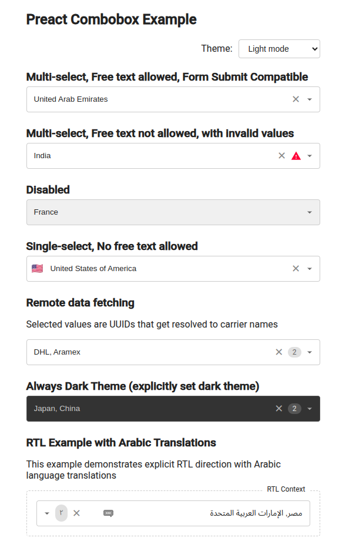

# PreactCombobox

A Preact multi-select/single-select combobox component.



Interactive examples - https://munawwar.github.io/preact-combobox/example/example.html

(The code for the examples is in the git repo `example/` directory).

## Installation

```bash
# `npm add preact` first
npm add preact-combobox @popperjs/core
```

## Usage

```jsx
import PreactCombobox from "preact-combobox";
import "preact-combobox/dist/esm/PreactCombobox.css";

const options = [
  { label: "Option 1", value: "option-1" },
  { label: "Option 2", value: "option-2", icon: "🔍" }, // Optional icon
];

function App() {
  const [values, setValues] = useState(["option-1"]);
  // For single-select mode
  const [singleValue, setSingleValue] = useState("option-1");

  return (
    <>
      {/* Multi-select (default) */}
      <PreactCombobox
        id="my-combobox"
        allowedOptions={options}
        value={values}
        onChange={setValues}
      />

      {/* Single-select */}
      <PreactCombobox
        id="single-select"
        multiple={false}
        allowedOptions={options}
        value={singleValue}
        onChange={setSingleValue}
      />
    </>
  );
}
```

## CSS

If you have a build tool:
```js
// In your main JS/TS entry file
import 'preact-combobox/dist/esm/PreactCombobox.css';
```

Or download the CSS file from `src/PreactCombobox.css` and use it directly. Or you could use a CDN like `esm.sh` or `unpkg.com` if you wish:
```css
@import 'https://esm.sh/preact-combobox/dist/esm/PreactCombobox.css';
/* Or use a CSS layer in modern browser to make overriding design easier */
@import 'https://esm.sh/preact-combobox/dist/esm/PreactCombobox.css' layer(components);
/* Or */
@layer components {
  @import 'https://esm.sh/preact-combobox/dist/esm/PreactCombobox.css';
}
```

### Customizing Styles

You can customize the component's appearance by overriding CSS variables. The component uses CSS variables for theming:

```css
:root {
  /* Light theme overrides */
  --preact-combobox-light-bg: #fff;
  --preact-combobox-light-text: #333;
  --preact-combobox-light-border: #ddd;
  /* See PreactCombobox.css for all available variables */
}
```

## Without build tools

```html
<script type="importmap">
  {
    "imports": {
      "preact": "https://esm.sh/preact@10",
      "preact/hooks": "https://esm.sh/preact@10/hooks",
      "preact/jsx-runtime": "https://esm.sh/preact@10/jsx-runtime",
      "preact/compat": "https://esm.sh/preact@10/compat",
      "htm": "https://esm.sh/htm",
      "@popperjs/core": "https://esm.sh/@popperjs/core@2",
      "preact-combobox": "https://esm.sh/preact-combobox",
    }
  }
</script>
```

## Component Props

| Prop | Type | Default | Description |
|------|------|---------|-------------|
| `id` | `string` | (required) | Component ID |
| `className` | `string` | `""` | Additional CSS class |
| `allowedOptions` | `Option[] \| Function` | (required) | Array of options or function for lazy-loading |
| `onChange` | `Function` | (required) | Callback for value change |
| `value` | `string[] \| string` | `[]` or `""` | Selected value(s) |
| `multiple` | `boolean` | `true` | Enable multi-select mode |
| `allowFreeText` | `boolean` | `false` | Allow custom values |
| `language` | `string` | `"en"` | BCP 47 language code for text matching and word segmentation (passed directly to Intl.Segmenter and Intl.Collator) |
| `placeholder` | `string` | `""` | Input placeholder text shown when no selections are made |
| `disabled` | `boolean` | `false` | Disable the combobox |
| `required` | `boolean` | `false` | Mark as required |
| `showClearButton` | `boolean` | `true` | Show clear button for selections |
| `name` | `string` | `undefined` | Input name (for forms) |
| `theme` | `"light" \| "dark" \| "system"` | `"system"` | Theme for the component |
| `showValue` | `boolean` | `false` | Show value alongside label |
| `optionRenderer` | `Function` | `defaultOptionRenderer` | Custom option renderer |
| `optionIconRenderer` | `Function` | `defaultOptionIconRenderer` | Custom icon renderer for options |
| `translations` | `Translations` | `defaultEnglishTranslations` | Localization strings |
| `formSubmitCompatible` | `boolean` | `false` | Include hidden form elements for submission |
| `portal` | `HTMLElement` | `document.body` | Element to render dropdown into |
| `rootElementProps` | `Object` | `{}` | Props for root element |
| `inputProps` | `Object` | `{}` | Props for input element |
| `selectElementProps` | `Object` | `{}` | Props for hidden select element |
| `warningIcon` | `VNode` | (default icon) | Custom warning icon |
| `chevronIcon` | `VNode` | (default icon) | Custom dropdown icon |
| `loadingRenderer` | `(text: string) => VNode\|string` | (default text) | Custom loading indicator |

## Advanced Features

### Async/Lazy-loaded Options

```jsx
// Simulate API call for options
const fetchOptions = async (query, limit, currentSelections, signal) => {
  // Return Promise<Option[]>
  const response = await fetch(`/api/search?q=${query}&limit=${limit}`, { signal });
  return response.json();
};

function LazyExample() {
  const [values, setValues] = useState([]);
  
  return (
    <PreactCombobox
      id="lazy-example"
      allowedOptions={fetchOptions}
      value={values}
      onChange={setValues}
      placeholder="Type to search..."
    />
  );
}
```

### RTL Support and Translations (Experimental)

```jsx
const arabicTranslations = {
  searchPlaceholder: "بحث...",
  noOptionsFound: "لم يتم العثور على خيارات",
  loadingOptions: "جاري التحميل...",
  // Additional translations...
};

function RTLExample() {
  const [values, setValues] = useState([]);
  
  return (
    <div dir="rtl">
      <PreactCombobox
        id="rtl-example"
        allowedOptions={options}
        value={values}
        onChange={setValues}
        language="ar"
        translations={arabicTranslations}
      />
    </div>
  );
}
```

### Form Submission Compatible

```jsx
<form onSubmit={handleSubmit}>
  <PreactCombobox
    id="form-example"
    allowedOptions={options}
    value={values}
    onChange={setValues}
    formSubmitCompatible={true}
    name="selected-options"
    // use true if you are doing a server-side render
    isServer={typeof self === "undefined"}
  />
  <button type="submit">Submit</button>
</form>
```

### Customizing Rendering and Icons

```jsx
import { h } from "preact";

// Here is how to customize the looks of dropdown options
// This is the exact defaultOptionRenderer from PreactCombobox.jsx
import { matchSlicesToNodes } from 'preact-combobox';

/** @type {import('preact-combobox').OptionTransformFunction} */
function defaultOptionRenderer({
  option,
  isSelected,
  isInvalid,
  showValue,
  warningIcon,
  optionIconRenderer,
}) {
  const isLabelSameAsValue = option.value === option.label;
  /**
   * @param {(VNode|string)[]} labelNodes
   * @param {(VNode|string)[]} valueNodes
   * @returns {VNode}
   */
  const getLabel = (labelNodes, valueNodes) => (
    <>
      {optionIconRenderer?.(option, false)}
      <span className="PreactCombobox-optionLabelFlex">
        <span>{labelNodes}</span>
        {isLabelSameAsValue || !showValue ? null : (
          <span className="PreactCombobox-optionValue" aria-hidden="true">
            ({valueNodes})
          </span>
        )}
      </span>
    </>
  );

  const { label, value, matched, matchSlices } = option;
  let labelElement;
  if (matched === "label" || (matched === "value" && value === label)) {
    const labelNodes = matchSlicesToNodes(matchSlices, label);
    labelElement = getLabel(labelNodes, [value]);
  } else if (matched === "value") {
    const valueNodes = matchSlicesToNodes(matchSlices, value);
    labelElement = getLabel([label], valueNodes);
  } else {
    // if matched === "none"
    labelElement = getLabel([label], [value]);
  }

  return (
    <>
      <span
        className={`PreactCombobox-optionCheckbox ${
          isSelected ? "PreactCombobox-optionCheckbox--selected" : ""
        }`}
      >
        {isSelected && <span aria-hidden="true">✓</span>}
      </span>
      {labelElement}
      {isInvalid && warningIcon}
    </>
  );
}

// Here is how to customize the looks of the icon rendered before the option label text and input field
/** @type {NonNullable<import('preact-combobox').PreactComboboxProps['optionIconRenderer']>} */
const customIconRenderer = (option, isInput) => {
  // Commented out code is the exact default icon renderer from PreactCombobox.jsx
  // return option.icon ? (
  //   <span className="PreactCombobox-optionIcon" aria-hidden="true" role="img">
  //     {option.icon}
  //   </span>
  // ) : null;

  // But let me show you what else you could do:

  const category = option.value.split('-')[0];
  // or you could pass option.category in allowedOptions list and then do:
  // const { category } = option;
  
  // Different icon size when shown in input vs dropdown
  const size = isInput ? 16 : 20;
  
  // Icon mapping based on category
  const icons = {
    fruit: ,
    vegetable: ,
    other: 
  };
  
  return (
    <span className={`custom-icon category-${category}`}>
      {icons[category] || icons.other}
    </span>
  );
};

// Here is how to customize the warning icon (static, not a function)
const customWarningIcon = ;

// Here is how to customize the dropdown chevron (static, not a function)
const customChevronIcon = 

// Here is how to customize the loading indicator
/** @type {NonNullable<import('preact-combobox').PreactComboboxProps['loadingRenderer']>} */
const customLoadingRenderer = (text) => (
  <div className="custom-loading">
    <svg className="spinner" viewBox="0 0 24 24" width="16" height="16">
      <circle cx="12" cy="12" r="10" stroke="currentColor" fill="none" strokeWidth="2" />
    </svg>
    <span>{text}</span>
  </div>
);

function CustomRenderingExample() {
  const [values, setValues] = useState([]);
  const options = [
    { label: "Apple", value: "fruit-apple", description: "Red and sweet" },
    { label: "Banana", value: "fruit-banana", description: "Yellow and curved" },
    { label: "Carrot", value: "vegetable-carrot", description: "Orange and crunchy" },
    { label: "Broccoli", value: "vegetable-broccoli", description: "Green and healthy" },
    { label: "Other item", value: "other-item", description: "Miscellaneous" }
  ];
  
  return (
    <PreactCombobox
      id="custom-rendering-example"
      allowedOptions={options}
      value={values}
      onChange={setValues}
      optionRenderer={defaultOptionRenderer}
      optionIconRenderer={customIconRenderer}
      warningIcon={customWarningIcon}
      chevronIcon={customChevronIcon}
      loadingRenderer={customLoadingRenderer}
    />
  );
}
```

## Option Object Format

```js
{
  label: "Display Text", // Required: text shown in dropdown
  value: "option-value", // Required: unique identifier
  icon: "🔍" // Optional: icon (string or VNode)
}
```

## About Accessibility

Some attempt has been made to make the component accessible in the following dimensions:
- Keyboard navigation
- Basic screen reader test only on Orca (v46.1). Help me out to test on more software and platforms.
- Default colors for light mode theme (passes WCAG and APCA contrast)

## Run Demo

```bash
npm run dev
# open http://localhost:3050/example/example.html in a browser
```