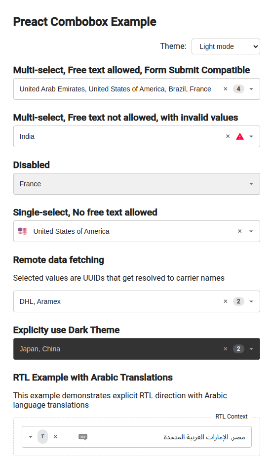

# PreactCombobox

Work-in-progress: Be cautious using this on production. This is an alpha release.

A Preact multi-select/single-select combobox component.



## Installation

```bash
# `npm add preact` first
npm add preact-combobox @popperjs/core
```

## Basic Usage

```jsx
import PreactCombobox from "preact-combobox";

const options = [
  { label: "Option 1", value: "option-1" },
  { label: "Option 2", value: "option-2", icon: "🔍" }, // Optional icon
];

function App() {
  const [values, setValues] = useState(["option-1"]);
  // For single-select mode
  const [singleValue, setSingleValue] = useState("option-1");

  return (
    <>
      {/* Multi-select (default) */}
      <PreactCombobox
        id="my-combobox"
        allowedOptions={options}
        value={values}
        onChange={setValues}
      />

      {/* Single-select */}
      <PreactCombobox
        id="single-select"
        multiple={false}
        allowedOptions={options}
        value={singleValue}
        onChange={setSingleValue}
      />
    </>
  );
}
```

## Component Props

| Prop | Type | Default | Description |
|------|------|---------|-------------|
| `id` | `string` | (required) | Component ID |
| `allowedOptions` | `Option[] \| Function` | (required) | Array of options or function for lazy-loading |
| `onChange` | `Function` | (required) | Callback for value change |
| `value` | `string[] \| string` | `[]` or `""` | Selected value(s) |
| `multiple` | `boolean` | `true` | Enable multi-select mode |
| `allowFreeText` | `boolean` | `false` | Allow custom values |
| `language` | `string` | `"en"` | BCP 47 language code for text matching and word segmentation (passed directly to Intl.Segmenter and Intl.Collator) |
| `placeholder` | `string` | `""` | Input placeholder text shown when no selections are made |
| `disabled` | `boolean` | `false` | Disable the combobox |
| `required` | `boolean` | `false` | Mark as required |
| `showClearButton` | `boolean` | `true` | Show clear button for selections |
| `name` | `string` | `undefined` | Input name (for forms) |
| `className` | `string` | `""` | Additional CSS class |
| `theme` | `"light" \| "dark" \| "system"` | `"system"` | Theme for the component |
| `showValue` | `boolean` | `false` | Show value alongside label |
| `optionRenderer` | `Function` | `defaultOptionRenderer` | Custom option renderer |
| `optionIconRenderer` | `Function` | `defaultOptionIconRenderer` | Custom icon renderer for options |
| `translations` | `Translations` | `defaultEnglishTranslations` | Localization strings |
| `formSubmitCompatible` | `boolean` | `false` | Include hidden form elements for submission |
| `portal` | `HTMLElement` | `document.body` | Element to render dropdown into |
| `rootElementProps` | `Object` | `{}` | Props for root element |
| `inputProps` | `Object` | `{}` | Props for input element |
| `selectElementProps` | `Object` | `{}` | Props for hidden select element |
| `warningIcon` | `VNode` | (default icon) | Custom warning icon |
| `chevronIcon` | `VNode` | (default icon) | Custom dropdown icon |
| `loadingRenderer` | `(text: string) => VNode\|string` | (default text) | Custom loading indicator |

## Advanced Features

### Async/Lazy-loaded Options

```jsx
// Simulate API call for options
const fetchOptions = async (query, limit, currentSelections, signal) => {
  // Return Promise<Option[]>
  const response = await fetch(`/api/search?q=${query}&limit=${limit}`, { signal });
  return response.json();
};

function LazyExample() {
  const [values, setValues] = useState([]);
  
  return (
    <PreactCombobox
      id="lazy-example"
      allowedOptions={fetchOptions}
      value={values}
      onChange={setValues}
      placeholder="Type to search..."
    />
  );
}
```

### RTL Support and Translations

```jsx
const arabicTranslations = {
  searchPlaceholder: "بحث...",
  noOptionsFound: "لم يتم العثور على خيارات",
  loadingOptions: "جاري التحميل...",
  // Additional translations...
};

function RTLExample() {
  const [values, setValues] = useState([]);
  
  return (
    <div dir="rtl">
      <PreactCombobox
        id="rtl-example"
        allowedOptions={options}
        value={values}
        onChange={setValues}
        language="ar"
        translations={arabicTranslations}
      />
    </div>
  );
}
```

### Form Submission Compatible

```jsx
<form onSubmit={handleSubmit}>
  <PreactCombobox
    id="form-example"
    allowedOptions={options}
    value={values}
    onChange={setValues}
    name="selected-options"
    formSubmitCompatible={true}
    required={true}
  />
  <button type="submit">Submit</button>
</form>
```

## Option Object Format

```js
{
  label: "Display Text", // Required: text shown in dropdown
  value: "option-value", // Required: unique identifier
  icon: "🔍" // Optional: icon (string or VNode)
}
```

## Run Demo

```bash
npm run dev
# open http://localhost:3050/example/example.html in a browser
```